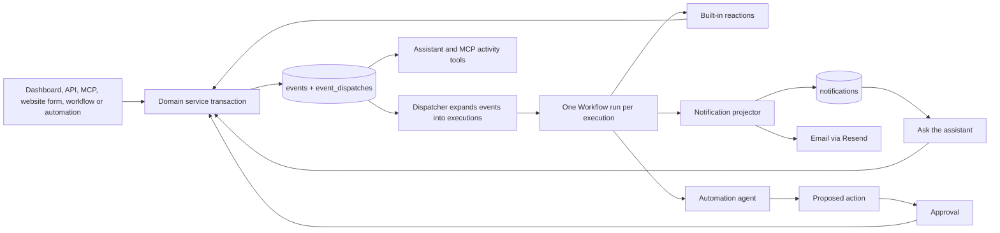

# Events, notifications, and automations

Status: proposed. The first release covers three things: the event core, a Midday-style inbox with email, and events
that agents can act on. Outgoing webhooks and Zapier come later on the same pipeline (§16 and §17). Only §2 describes
existing behavior.

Checked against the repository and installed packages on 2026-09-24: `workflow` 5.0.0-beta.55, `@mastra/core` 1.68.0,
`better-auth` and `@better-auth/api-key` 1.7.5, `resend` 6.28.1 and `@orpc/server` 2.0.0-beta.39. Re-check
version-specific behavior before starting each phase.

## 1. Overview

Starter records the business facts that other features react to as **events** in Postgres. Everything that reacts is a
**consumer**:

- the notification projector turns events into inbox rows and optional emails;
- the assistant reads events, explains them and acts on them with its existing tools;
- automation rules run a restricted agent that can read, draft and propose changes;
- built-in reactions, such as contact-message triage, run the same way;
- later, outgoing webhooks and Zapier deliver a public projection of events to external URLs.

Consumers are independent. Reading a notification never cancels an automation, and one failing consumer never delays
another. A consumer that changes data calls the owning domain service, which commits the change and records a new event.

| Term         | Meaning                                                                                           |
| ------------ | ------------------------------------------------------------------------------------------------- |
| Event        | Immutable, organization-scoped fact, committed in the same transaction as the change it describes |
| Consumer     | Built-in reaction, notification projector or automation rule (webhooks and Zapier later)          |
| Execution    | One consumer's work for one event: frozen input, state, attempts and outcome                      |
| Notification | One inbox row for one recipient, with seen, read, archived and resolved state                     |
| Delivery     | One external send of a notification (email), with provider facts such as delivered or bounced     |
| Action       | A change made through a domain service; agent actions can require approval                        |



Decisions:

- **Postgres is the source of truth.** An event and its outbox row commit with the business change or not at all.
- **Vercel Workflow runs every execution.** One run per execution, durable `sleep()` for delays and retries, and hooks
  for approvals. The database decides whether work is still wanted and records every attempt.
- **The inbox follows Midday's experience** (bell, Inbox and Archive tabs, per-type settings, email per type) without
  its data problems (§12).
- **Agents act through existing tools.** The assistant gets notification context and activity tools. Automations use a
  second, restricted agent that records proposed changes; approved proposals execute through domain services, so no
  agent run stays suspended while it waits for a person.
- **Resend and React Email send email.** Resend's suppression list handles bounced and complaining addresses.
- **No broker, hosted notification service or new workspace package.** §11 records why, including the Novu comparison.

## 2. Current state

Verified behavior that this plan depends on or must change. Paths are relative to the repository root.

### Producers and domain writes

- Interactive mutations commit in transactions: `createContact`, `updateContact` and `deleteContact`
  (`packages/server/src/services/contacts.ts`); `editWebsite`, `publishWebsite` and `completeWebsiteWorkflow`
  (`packages/server/src/services/websites/service.ts`); `saveLinkPage` and `publishLinkPage`
  (`packages/server/src/services/link-pages.ts`); and blog create, update, publish, unpublish, delete and generation
  claim (`packages/server/src/services/blog-posts`).
- These writes run outside a transaction and need one before they can append events:
    - website creation in `prepareWebsiteGenerationStart`, `claimWebsiteWorkflowRun` and `cancelWebsiteWorkflow`;
    - the run-ID reset in `packages/server/src/services/websites/workflow-stream.ts`;
    - the triage save at the end of `triageContactMessage`;
    - `saveGeneratedBlogPost`, and `reconcileBlogWorkflow`, which runs on the list and get requests that the blog UI
      polls every two seconds;
    - the run bind and start-failure writes in `packages/server/src/services/blog-posts/generation.ts`;
    - the `prepareInitialBlogDraft` and `failBlogDraft` workflow steps.
- `prepareInitialBlogDraft` and `saveInitialWebsiteLinkPage` insert with `onConflictDoNothing` but do not return rows,
  so they cannot tell whether they created anything.
- `saveLinkPage` and `publishWebsite` return early when nothing changed. `publishLinkPage`, `editWebsite`,
  `updateBlogPost` (always `revision + 1`) and `publishBlogPost` always write. `updateContact` writes only when a field
  changed and returns early otherwise.
- Revisions are opaque values: websites and link pages use `updatedAt`, and blog posts use integer `revision` and
  `publishedRevision`. `updateContact` sets `contacts.updatedAt` only when a field changed.
- `submitWebsiteContact` (`packages/server/src/services/websites/contact-submission.ts`) saves the contact and message
  in one transaction, then triages in `waitUntil`. It runs inside `apps/websites`, which has no Workflow runtime: only
  `apps/webapp/next.config.ts` uses `withWorkflow`. The notification projector
  (`packages/server/src/services/notifications/projector.ts`) turns each non-spam `contact_message.created` event into an
  in-app `contact_message_received` notification; no email is sent.
- Five website workflow kinds (`generation`, `template-change`, `section-addition`, `layout-generation`,
  `translation`) finish through `completeWebsiteWorkflow`, which is not told the kind. `markWebsiteWorkflowFailed` only
  logs and streams, and the UI infers failure from the run status. Website and blog workflow inputs do not record who
  started the run.
- Brand is part of the website. `publishBrand` calls `publishWebsite`, and Brand's revision is the website's
  `updatedAt`. Link pages read the draft Brand and freeze it as `publishedBrand` when published.
- Custom domains move from `pending` to `connected` in `reconcileWebsiteDomain`, which also deletes rows after
  `disconnectWebsiteDomain`. Files track ingestion in `files.rag_status` (`none`, `pending`, `ready`, `failed`) and
  record `uploaded_by`.

### Identity and access

- Roles come from `packages/server/src/utils/permissions.ts`. Owners hold `read`, `write` and `delete`, admins hold
  `read` and `write`, and members hold `read`. Procedures check them with `organizationPermission` from
  `packages/server/src/api/base.ts`.
- API keys belong to a user and an organization, and every request re-checks membership and role. Keys have no
  permissions of their own: `apikeys.permissions` is never read, so a key carries its user's whole role.
- `/api/v1` exposes procedures marked `publicApi(true)`: analytics, blog posts, brands, contacts, domains, link pages,
  notification settings and SEO. Websites have none. It accepts API keys and sessions but not OAuth tokens; OAuth serves
  MCP only. Contact events written through `/api/v1` record `source: "api"`.
- `/api/mcp` registers its tools by hand in `packages/server/src/api/mcp.ts` and its `src/api/mcp-tools` modules, scoped
  to the session's user and organization. Contact events written through MCP record `source: "mcp"`.
- `packages/server/src/lib/auth.ts` wires `beforeRemoveMember`, `beforeUpdateMemberRole` and the organization-deletion
  hooks, and `beforeDeleteOrganization` already stops AI activity. `afterRemoveMember` and `afterUpdateMemberRole`
  exist in Better Auth 1.7.5 but are not wired.
- `users` has no locale or time zone. next-intl uses the fixed `America/New_York` time zone.

### Agents and chat

- One Mastra agent, `dashboardChatAgent`, is registered in `packages/server/src/mastra/index.ts`. Its tools
  (`packages/server/src/ai/tools/*.ts`) act as the requesting member through `requestContext`, mutations use
  `requireApproval`, memory is keyed to the organization, and chat resumes approvals through `listSuspendedRuns`.
- The dashboard home page (`/dashboard`, with `?chatId=`) hosts the assistant. Each turn carries an `AppContext`
  (`packages/server/src/ai/types.ts`) with fields such as `routedSkill` and `websiteEditor`, and chat messages support
  custom data parts (`BaseCustomUIDataTypes`).
- konsistent's `ai-agent-module` rule describes `packages/server/src/ai/agent.ts` as the single dashboard agent module,
  and `ai-tools-export-tool` requires each `packages/server/src/ai/tools/{domain}.ts` to export `{domain}Tools`.

### Interface

- Page headers use `Header` or `SearchableHeader` from
  `apps/webapp/src/app/[locale]/dashboard/components/layout/header/`. Navigation is the sidebar; there is no global top
  bar.
- Settings is a modal driven by `?settings=` with Profile, Organization, Team and Developers tabs (`settings-tabs.ts`).
- Record details open as drawers through URL parameters, such as `/dashboard/contacts?contact={id}`.

### Email

- `packages/email` renders React Email templates in English and Arabic. `supportedLocales` is `["en", "ar"]`,
  `EmailLayout` sets `lang` and `dir` from the resolved locale, and its fonts are Latin-only with system fallbacks for
  Arabic.
- Auth sends are Better Auth callbacks: the organization invitation and the sign-in code, composed in
  `packages/server/src/lib/auth-emails.ts` and sent through `sendEmail` in `packages/server/src/lib/resend.ts`. The
  sender is `EMAIL_FROM` (required when `NODE_ENV` is `production`), the locale comes from the `Referer` path of the
  requesting page, and a failed send throws an error without the recipient's address that Better Auth logs from its
  background-task handler. `WelcomeEmail` exists but is never sent.
- `builtin:notification_email` sends localized email to owners and admins for `contact_message_received`,
  `domain_expiring` and `domain_registration_failed`, one send per recipient with the delivery ID as the Resend
  idempotency key (`notification_email_deliveries`). The language follows the organization's website locale, and it runs
  only where `VERCEL_ENV` is `production` or `EVENTS_EXTERNAL_DELIVERY=1`. Provider receipts, one-click unsubscribe,
  `users.locale`, wait-for-triage and the other notification types remain unbuilt.

### Infrastructure

- `apps/webapp/vercel.json` defines the crons (`/api/events/dispatch` and `/api/domains/reconcile` every minute, `/api/events/retention` hourly, `/api/domains/registrations` and `/api/maintenance/retention` daily); each handler requires `Authorization: Bearer $CRON_SECRET`.
- Postgres uses a node-postgres `Pool` with `attachDatabasePool` (`packages/db/src/index.ts`), and Drizzle supports
  `.for("update", { skipLocked: true })`. Redis is available through `REDIS_URL` (ioredis). `packages/cache` exports an
  Upstash-backed `createRateLimiter` that nothing uses yet.
- No encryption code is in use; `better-auth/crypto` exports `symmetricEncrypt` and `symmetricDecrypt`. The unused
  `oauth_connections` table stores provider tokens in plaintext, and Search Console tokens live in Better Auth
  `accounts`.
- Workflow progress streams, chat data-change notices, Tinybird analytics, PostHog telemetry and the home page's list of
  recent contacts and posts are separate signals. They stay as they are and never become business events.

## 3. Guarantees

1. **Atomic.** A committed change and its events exist together or not at all. Rolled-back and no-op writes emit
   nothing.
2. **Trusted facts.** Only domain services append events. Request bodies never choose the organization, actor or type.
3. **At least once.** Every committed event is expanded, and every execution reaches a terminal state or a visible
   nonterminal one. Side effects use stable keys; nothing promises exactly-once network effects.
4. **Isolated.** A failing consumer or recipient never delays or repeats another's work.
5. **Current authority.** Membership, role and rule status are checked immediately before each side effect, not only
   when something was configured.
6. **Frozen inputs.** Retries reuse the execution's frozen configuration and payload. Configuration edits affect only
   executions created afterwards.
7. **Honest states.** "Sent" means the provider accepted the message. "Delivered" comes only from a verified provider
   receipt. "Seen" and "read" come only from the recipient's own actions.
8. **Recoverable.** A crash, lost wake-up, failed `start()` or deleted deployment delays work but never loses it.
9. **Untrusted content.** Event data, contact messages, web content and model output are data. They never choose
   tools, permissions, recipients or destinations.
10. **Minimal data.** Events contain no contact personal data, and logs contain IDs and error codes only.

## 4. Events

### 4.1 Envelope

```ts
export type EventEnvelope = {
	actor: EventActor;
	causationId: string | null;
	correlationId: string;
	data: unknown;
	depth: number;
	id: string;
	occurredAt: string;
	organizationId: string;
	producerKey: string;
	recordedAt: string;
	rootEventId: string;
	source: EventSource;
	subject: { id: string; revision: string | null; type: string };
	type: string;
	version: number;
};

export type EventActor =
	| { apiKeyId: string; type: "api_key"; userId: string }
	| { ruleId: string; type: "automation"; userId: string }
	| { type: "system" }
	| { type: "user"; userId: string }
	| { type: "visitor" };

export type EventSource = "api" | "automation" | "chat" | "dashboard" | "mcp" | "system" | "website" | "workflow";
```

The catalog narrows `type`, `subject.type` and `data` for each entry.

- `id` is a server-generated UUID. It is never reused and implies no order.
- `organizationId`, `actor` and `source` come from the authenticated context or the trusted producer.
- `occurredAt` is when the fact happened; `recordedAt` is when the row was inserted.
- `subject` is the resource the fact is about, with its revision after the change as an opaque string.
- `correlationId` is shared by every fact from one request, workflow completion or automation run.
- `causationId`, `rootEventId` and `depth` link automation-caused facts to the event that triggered them. Human and
  system facts have `depth` 0, no cause, and are their own root.
- `producerKey` is `{type}:{subject.id}:{discriminator}`. The discriminator is the resulting revision, or the message
  or run ID for creations and workflow outcomes, so replaying a producer yields the same key.
- `data` is a small summary validated by the type's Zod schema. It contains IDs, states and counts, never contact names,
  email addresses, phone numbers or message text (§10.3).

### 4.2 Naming and versions

- Types are `{subject}.{change}` in lower snake case. Subject names follow the code: `contact`, `contact_message`,
  `website`, `website_domain`, `link_page`, `blog_post`, `file`, `member`, `approval` and `automation_run`.
- Long-running work reports `{subject}.workflow_completed` or `{subject}.workflow_failed`, with the workflow in
  `data.kind`.
- Every type starts at `version: 1`. Adding an optional field keeps the version; removing, renaming or retyping a field
  creates the next one. Consumers record the version they receive, and the catalog keeps a version's projection while
  any consumer still receives it.

### 4.3 Catalog

`public` types can reach automations now, and webhooks and Zapier later. `internal` types feed notifications and
operations only. Phases refer to §13.

| Type                                              | Emitted when                                   | Producer                                                         | Phase | Visibility |
| ------------------------------------------------- | ---------------------------------------------- | ---------------------------------------------------------------- | ----- | ---------- |
| `contact.created`                                 | A contact row is inserted                      | `createContact`; `submitWebsiteContact` for a new email          | 1     | public     |
| `contact.updated`                                 | Contact fields change                          | `updateContact`                                                  | 1     | public     |
| `contact.deleted`                                 | A contact and its messages are deleted         | `deleteContact`                                                  | 1     | public     |
| `contact_message.created`                         | A website form message is saved                | `submitWebsiteContact`                                           | 1     | public     |
| `contact_message.triaged`                         | Triage results are saved                       | Triage reaction                                                  | 1     | public     |
| `website.created`                                 | The organization's website row is inserted     | `prepareWebsiteGenerationStart`                                  | 4     | public     |
| `website.updated`                                 | A draft edit commits                           | `editWebsite`                                                    | 4     | public     |
| `website.published`                               | The published pointer moves to a new version   | `publishWebsite` (also behind `publishBrand`)                    | 4     | public     |
| `website.workflow_completed`                      | A website workflow installs its draft          | `completeWebsiteWorkflow`                                        | 4     | public     |
| `website.workflow_failed`                         | A website workflow's failure is saved          | `markWebsiteWorkflowFailed`                                      | 4     | public     |
| `website_domain.connected`                        | A domain's status becomes `connected`          | `reconcileWebsiteDomain`                                         | 4     | public     |
| `website_domain.disconnected`                     | A disconnected domain row is removed           | `reconcileWebsiteDomain`                                         | 4     | public     |
| `link_page.updated`                               | A Links draft change commits                   | `saveLinkPage`                                                   | 4     | public     |
| `link_page.published`                             | The published document or frozen Brand changes | `publishLinkPage`                                                | 4     | public     |
| `blog_post.created`                               | A post row is inserted                         | `createBlogPost`, `prepareInitialBlogDraft`                      | 4     | public     |
| `blog_post.updated`                               | A draft change commits                         | `updateBlogPost`                                                 | 4     | public     |
| `blog_post.published`, `.unpublished`, `.deleted` | The transition commits                         | `publishBlogPost`, `unpublishBlogPost`, `deleteBlogPost`         | 4     | public     |
| `blog_post.workflow_completed`                    | Generated or translated content is saved       | `saveGeneratedBlogPost`                                          | 4     | public     |
| `blog_post.workflow_failed`                       | A generation or translation failure is saved   | `failBlogDraft`, the start-failure path, `reconcileBlogWorkflow` | 4     | public     |
| `file.ingestion_completed`, `.ingestion_failed`   | `rag_status` becomes `ready` or `failed`       | `ingest-file` workflow                                           | 4     | public     |
| `member.added`, `.removed`, `.role_changed`       | Better Auth commits a membership change        | Better Auth after-hooks                                          | 4     | internal   |
| `approval.requested`, `.resolved`                 | A proposal is saved or decided                 | Automations                                                      | 5     | internal   |
| `automation_run.failed`                           | An automation execution fails                  | Automations                                                      | 5     | internal   |

`data.kind` is one of the five website workflow kinds, or `generation` or `translation` for blog posts.

### 4.4 Emission rules

- Emit only for committed, effective changes. No-op saves, rejected writes, stale generation tokens, revision conflicts
  and the recovery branch of `completeWebsiteWorkflow` emit nothing.
- One event per fact. A submission from a new email emits `contact.created` and `contact_message.created` with one
  `correlationId` and different producer keys; a submission from a known email emits only `contact_message.created`.
- `updateContact` starts advancing `contacts.updatedAt`, which becomes the revision of `contact.updated`.
- `appendEvents` inserts with `ON CONFLICT (organization_id, producer_key) DO NOTHING`, so replaying a producer cannot
  duplicate a fact.
- `website.updated` lists the changed snapshot parts in `data.parts` (`structure`, `content`, `logic`, `brand`,
  `assets`, `template`). There are no `brand.*` events: Brand changes are website changes, and `website.published`
  covers Brand publication.
- A Brand edit changes the Links preview without writing `link_pages`, so it emits no `link_page.*` event.
- Every committed update is recorded, but `*.updated` types reach automations debounced (§6.3). Routine updates never
  create notifications.
- Deletion events carry IDs only. `contact.deleted` implies that the contact's messages were deleted too; there are no
  per-message deletion events.
- Better Auth commits membership changes before its after-hooks run, so `member.*` events are appended outside that
  transaction and can be lost if the process stops in between. Correctness never depends on them, because every side
  effect re-checks membership.
- Website and blog workflow inputs gain `initiatedByUserId`, which becomes the outcome event's actor and the
  notification recipient.

### 4.5 Event context

Agents, and later webhooks and Zapier, receive a versioned projection of an event, never the raw row or envelope.
`buildEventContext` (`packages/server/src/services/events/context.ts`) renders it from the event and the current domain
records it names, so it can include a contact's current name and email even though the event does not. When the subject
no longer exists, the projection says so and carries IDs only.

```json
{
	"data": {
		"contact": {
			"email": "ada@example.com",
			"id": "8b6e2f0a-4c1d-4f7e-9a3b-2d5c6e7f8a90",
			"name": "Ada Lovelace",
			"phone": null
		},
		"message": {
			"id": "3f1c9d2e-7a4b-4c8d-b5e6-1a2b3c4d5e6f",
			"text": "Do you have availability next week?",
			"truncated": false
		},
		"websiteId": "c2d4e6f8-1a3b-4c5d-8e7f-9a0b1c2d3e4f"
	},
	"id": "0f9a4c1e-6b1d-4a55-9d0e-3f2f6d0b7c11",
	"organizationId": "ORGANIZATION_ID",
	"timestamp": "2026-09-23T18:04:11.532Z",
	"type": "contact_message.created",
	"version": 1
}
```

`id` is the event ID and `timestamp` is `occurredAt`. Projections stay under 20 KB: long text is shortened and marked
with `truncated: true`. Visitor-written text is always labeled untrusted when it enters a prompt.

## 5. Persistence

Add tables in the phase that first needs them. Each table lives in its own file under
`packages/db/src/schema/{domain}/`, is exported from `packages/db/src/schema.ts` with relations in
`packages/db/src/relations.ts`, and gets its migration from `make migrate`. Follow the existing conventions: UUID
primary keys with `defaultRandom()`, `text` organization and user IDs that reference Better Auth tables with
`onDelete: "cascade"`, and `timestamp(..., { mode: "string", withTimezone: true })` columns.

| Table                            | Purpose                                                             | Phase |
| -------------------------------- | ------------------------------------------------------------------- | ----- |
| `events`                         | Immutable envelopes                                                 | 1     |
| `event_dispatches`               | Outbox: one row per event until it is expanded                      | 1     |
| `event_executions`               | One row per consumer per event: frozen input, state and outcome     | 1     |
| `event_execution_attempts`       | Append-only attempt history                                         | 1     |
| `notifications`                  | Inbox rows                                                          | 1     |
| `notification_inboxes`           | Per-recipient sequence and seen watermark                           | 1     |
| `notification_preferences`       | Sparse type × channel overrides per member                          | 1     |
| `notification_deliveries`        | One row per email send: destination, provider ID and delivery facts | 2     |
| `notification_delivery_receipts` | Verified provider webhook receipts                                  | 2     |
| `automation_rules`               | Trigger, instructions, run-as member, tools and limits              | 5     |
| `automation_actions`             | Proposed and approved changes                                       | 5     |

Columns and constraints:

- **`events`**: `id`, `organization_id`, `type`, `version`, `subject_type`, `subject_id`, `subject_revision`,
  `actor` (jsonb), `source`, `correlation_id`, `causation_id`, `root_event_id`, `depth`, `producer_key`, `data`
  (jsonb), `occurred_at`, `recorded_at`. Unique `(organization_id, producer_key)`. Index on `recorded_at` for
  retention. Only retention and organization deletion remove rows.
- **`event_dispatches`**: `event_id` (primary key), `organization_id`, `available_at`, `attempts`, `last_error_code`,
  `expanded_at`. Partial index on `available_at` where `expanded_at` is null.
- **`event_executions`**: `id`, `organization_id`, `event_id`, `consumer_key`, `consumer_kind` (`builtin`,
  `notification_email`, `automation`; `webhook` later), `state`, `outcome_code`, `available_at`, `attempt_count`,
  `next_attempt_at`, `expected_by`, `workflow_run_id`, `start_requested_at`, `config` (jsonb), `payload` (text),
  `refs` (jsonb: Mastra run and trace IDs), `created_at`, `updated_at`, `completed_at`. Unique
  `(event_id, consumer_key)`. Partial index on `(state, available_at)` for nonterminal states, and an index on
  `(organization_id, consumer_kind, created_at)`.
- **`event_execution_attempts`**: `id`, `execution_id`, `organization_id`, `attempt_number`, `started_at`,
  `finished_at`, `result` (`success`, `retryable`, `permanent`, `unknown`), `status_code`, `error_code`, `duration_ms`,
  `response_excerpt` (at most 1 KB, sanitized). Unique `(execution_id, attempt_number)`.
- **`notifications`**: `id`, `organization_id`, `recipient_user_id`, `event_id`, `type`, `sequence` (bigint),
  `group_key`, `subject_type`, `subject_id`, `params` (jsonb, typed per notification type), `created_at`, `seen_at`,
  `read_at`, `archived_at`, `resolved_at`. Unique `(event_id, type, recipient_user_id)`. Indexes on
  `(organization_id, recipient_user_id, sequence)` and partial indexes for unarchived rows where `seen_at` is null.
- **`notification_inboxes`**: primary key `(organization_id, user_id)`, `last_sequence`, `seen_through_sequence`.
- **`notification_preferences`**: `organization_id`, `user_id`, `type`, `channel` (`in_app`, `email`), `enabled`,
  `updated_at`. Unique `(organization_id, user_id, type, channel)`. A missing row means the registry default.
- **`notification_deliveries`**: `id`, `organization_id`, `execution_id` (unique), `notification_id`, `channel`,
  `destination`, `locale`, `provider`, `provider_message_id`, `accepted_at`, `delivered_at`, `delayed_at`, `bounced_at`,
  `bounce_type`, `complained_at`, `failed_at`, `suppressed_at`, `opened_at`, `clicked_at`. Unique
  `(provider, provider_message_id)`.
- **`notification_delivery_receipts`**: `id`, `provider`, `provider_event_id`, `type`, `occurred_at`, `received_at`,
  `provider_message_id`, `delivery_id` (null until matched), `details` (jsonb without addresses, subjects or bodies).
  Unique `(provider, provider_event_id)`.
- **`automation_rules`**: `id`, `organization_id`, `name`, `event_type`, `filter` (jsonb, validated per event type),
  `instructions`, `run_as_user_id`, `tools` (text array), `status` (`active`, `paused`), `paused_reason`,
  `daily_run_limit`, `version`, `created_at`, `updated_at`.
- **`automation_actions`**: `id`, `organization_id`, `execution_id`, `rule_id`, `tool`, `input` (jsonb), `input_hash`,
  `subject_type`, `subject_id`, `subject_revision`, `required_permission`, `state` (`proposed`, `approved`, `denied`,
  `expired`, `executed`, `failed`, `stale`), `expires_at`, `decided_by_user_id`, `decided_at`, `result` (jsonb),
  `created_at`.

## 6. Dispatch and execution

### 6.1 Write path

Producers call `appendEvents` inside their existing transaction, then wake the dispatcher after commit:

```ts
const saved = await db.transaction(async (transaction) => {
	// Existing domain writes produce contactId, messageId and organizationId.
	const events = await appendEvents({
		events: [
			{
				actor: { type: "visitor" },
				data: { contactId, messageId, sectionId, websiteId },
				source: "website",
				subject: { id: messageId, revision: null, type: "contact_message" },
				type: "contact_message.created",
			},
		],
		organizationId,
		transaction,
	});

	return { eventIds: events.map(({ id }) => id), messageId };
});

waitUntil(wakeEventDispatcher({ eventIds: saved.eventIds }));
```

- `appendEvents` validates `data` against the catalog, fills the envelope, inserts `events` and `event_dispatches`, and
  returns the rows it inserted. A validation or insert failure fails the whole transaction.
- `wakeEventDispatcher` posts `{ eventIds }` to the webapp's dispatcher route (§6.4) with
  `Authorization: Bearer ${CRON_SECRET}`. It reads the route's origin from `WEBAPP_URL`; the webapp falls back to
  `getBaseURL()`. A failed wake-up is logged by event ID and recovered by the cron.
- `apps/websites` needs `WEBAPP_URL` (the webapp's public origin) and the webapp's `CRON_SECRET` in every environment.
  Without `CRON_SECRET` its wake-ups are skipped with a warning. Without `WEBAPP_URL` the fallback `getBaseURL()`
  resolves to the websites project's own origin, the request gets a 404 and is logged, and website leads wait for the
  next cron run. Locally, put `WEBAPP_URL=http://localhost:3000` and the webapp's `CRON_SECRET` in
  `apps/websites/.env.local`.
- Every producer calls the same helper. Request handlers wrap it in `waitUntil`; workflow steps await it.

### 6.2 Expansion

The dispatcher expands each pending event in its own short transaction:

1. Select the dispatch row with `FOR UPDATE SKIP LOCKED`.
2. Match consumers: the catalog's built-in reactions (including the notification projector) and active
   `automation_rules` for the type. Rules created after the event's `recorded_at` are excluded.
3. Insert one `event_executions` row per consumer with `ON CONFLICT (event_id, consumer_key) DO NOTHING`, freezing the
   consumer's configuration in `config`.
4. Set `expanded_at`, commit, and start a run for each new execution.

A failed expansion rolls back, increments `attempts` and moves `available_at` forward (30 seconds, then doubling to one
hour). Unknown event types stay unexpanded with the same capped backoff and are left out of the sweep after 24 attempts
(`last_error_code` and `attempts` remain on the `event_dispatches` row; resetting `attempts` to 0 replays them). A
background triage that produces no decision retries on the ladder and ends `retries_exhausted`, and an unknown consumer
retries on the ladder before ending `failed` with `unknown_consumer`. Consumer keys are `builtin:{name}` (for example `builtin:notifications` and `builtin:contact_triage`),
`notification_email:{notificationId}` and `automation:{ruleId}`. Filters live only on the consumer row: `event_type` and
`filter` on rules.

### 6.3 Execution runs

Every execution runs in `runEventExecutionWorkflow` (`packages/server/src/workflows/run-event-execution/`):

```ts
export const runEventExecutionWorkflow = async (executionId: string) => {
	"use workflow";

	let next = await claimEventExecution({ executionId });

	while (next.status !== "done") {
		if (next.status === "approval") {
			await Promise.race([createHook({ token: next.token }), sleep(new Date(next.expiresAt))]);
		} else {
			await sleep(new Date(next.until));
		}

		next = await continueEventExecution({ executionId });
	}
};
```

- **Claim.** `claimEventExecution` sets `state = 'running'` and `workflow_run_id` from `getWorkflowMetadata()` only
  if the row is still `queued` and unowned. A duplicate run fails the claim and exits. Every later write is fenced with
  `WHERE workflow_run_id = $runId`, so an obsolete run cannot overwrite newer state.
- **Delays.** A claim before `available_at` returns `{ status: "wait", until: available_at }`. That is how the
  debounce and email timing below work.
- **Attempts.** `continueEventExecution` rechecks authority and consumer status, records an attempt row, performs at
  most one side effect and returns the next step. Side-effect steps set `maxRetries = 0`, because Workflow otherwise
  retries failed steps immediately and without backoff. The loop above owns every retry.
- **Keys.** Provider idempotency keys are the execution ID. Workflow's `stepId` changes when a run is replaced, so it is
  never used as a key.
- **Frozen payload.** The first attempt renders the payload into `event_executions.payload`, and later attempts send
  those exact bytes.
- **Debounce.** Automation executions for `*.updated` types start 60 seconds after the event. When one runs, it finishes
  as `skipped` (`superseded`) if a newer event of the same type exists for the same subject, so rules see the latest
  update after 60 quiet seconds.
- **Deadline.** Each step sets `expected_by`: 15 minutes after an attempt starts, or 15 minutes after the time the run
  should next wake up. Recovery uses it to find stranded runs.

### 6.4 Dispatcher, recovery and scheduling

`apps/webapp/src/app/api/events/dispatch/route.ts` is wrapped in `withErrorHandler` and requires
`Authorization: Bearer ${CRON_SECRET}`. It accepts:

- `POST` with `{ eventIds }` from `wakeEventDispatcher`, which expands those events first;
- `GET` from Vercel Cron every minute.

Each call processes bounded batches of 100:

1. Expand due dispatch rows, oldest first.
2. Start runs for `queued` executions whose `available_at` has passed and whose `start_requested_at` is empty or more
   than two minutes old.
3. Reconcile nonterminal executions whose `expected_by` has passed. Whether `getRun(workflow_run_id)` reports a
   finished run, no run, or a run stuck past its deadline (for example on a deleted deployment), cancel any active run
   and return the execution to `queued` with a fenced update. The execution ID stays the same, so a restarted send
   reuses the same email idempotency key.

Add both crons to `apps/webapp/vercel.json`:

```json
{
	"crons": [
		{ "path": "/api/events/dispatch", "schedule": "* * * * *" },
		{ "path": "/api/events/retention", "schedule": "17 * * * *" }
	]
}
```

- A per-minute cron needs Vercel Pro or Enterprise; on Hobby, that schedule makes the deployment fail.
- Vercel runs crons only against the production deployment, occasionally skips or repeats a run, and does not retry
  failures. Wake-ups handle the normal path; the minute cron is the backstop.
- Locally, `bun dev` runs `dev:cron` (`apps/webapp/scripts/dev-cron.ts`). Every minute it calls each per-minute cron
  in `vercel.json` with the `CRON_SECRET` from `apps/webapp/.env.local`.
- Preview deployments rely on wake-ups. To exercise recovery there, call the route with the secret.

### 6.5 States

| State               | Meaning                                                                                                                                                                            |
| ------------------- | ---------------------------------------------------------------------------------------------------------------------------------------------------------------------------------- |
| `queued`            | Created, not yet owned by a run                                                                                                                                                    |
| `running`           | Owned by `workflow_run_id`                                                                                                                                                         |
| `retry_wait`        | Waiting until `next_attempt_at`                                                                                                                                                    |
| `awaiting_approval` | Waiting for an `automation_actions` decision                                                                                                                                       |
| `succeeded`         | Done; `outcome_code` says what happened (`projected`, `triaged`, `email_accepted`, `action_executed`)                                                                              |
| `skipped`           | Deliberately not acted on (`superseded`, `subject_deleted`, `preference_off`, `recipient_removed`, `spam`, `approval_denied`, `approval_expired`, `loop_limit`, `owned_elsewhere`) |
| `failed`            | Gave up (`retries_exhausted`, `provider_rejected`, `stale_revision`, `unknown_consumer`)                                                                                           |
| `cancelled`         | Stopped by an operator, a paused rule, or organization deletion                                                                                                                    |
| `unknown`           | The side effect may have happened; an operator decides                                                                                                                             |

A `retry` operation on a `failed` or `unknown` execution returns it to `queued` under the same ID. Retries never create
a second execution for the same consumer and event.

### 6.6 Ordering

Nothing guarantees delivery order. Projections carry `timestamp`, the event `id` and the subject's revision.
Automations compare the subject's current revision before executing a proposal and finish as `failed`
(`stale_revision`) when it moved, so an old event can never overwrite newer state.

## 7. Inbox and notifications

### 7.1 Experience

The inbox mirrors Midday's notification center.

- **Bell.** Notifications is the first item in the sidebar footer, above Language, Settings and Log out. A small dot
  in the primary token sits on its bell while any notification is unseen, in both the expanded and icon-only sidebar.
- **Panel.** The item opens a 400-pixel popover anchored to the menu item, so it opens just past the sidebar edge on
  desktop and above the item in the mobile sidebar. It has two tabs, Inbox and Archive, and a settings button that
  opens the Notifications settings tab (`?settings=notifications`).
- **Rows.** Each row shows:
    - the type's icon in a 36-pixel circle;
    - a one-line description rendered from the type and its params, in medium weight while unread;
    - the relative time;
    - an Archive button in the Inbox tab, and an Ask button when the type has agent context (§8.2).
- **Clicking a row** marks it read, closes the panel and opens its target, usually a drawer through a URL parameter
  such as `/dashboard/contacts?contact={contactId}`.
- **Footer.** The Inbox tab ends with Archive all, which archives every row through the newest sequence shown.
- **Loading.** The panel loads 20 rows and fetches more with Load more. There is no separate notifications page.
- **Grouping.** Adjacent unread rows with the same type and `group_key` collapse into one row with a count, for example
  "3 new messages from Ada Lovelace". Opening or archiving the group applies to every row in it.
- **Opening** the panel marks the rows it shows as seen, which clears the dot. Rows stay medium weight until read.
- **Empty states** show a short label only: "No new notifications" and "Nothing in the archive".
- **Build it** with the `starter-ui` conventions: shared Popover and Sidebar primitives, `HugeiconsIcon`, next-intl
  messages in `en.json` and `ar.json`, logical properties for RTL, and keyboard access to every action.

### 7.2 Notification types

`packages/server/src/services/notifications/registry.ts` defines each type, in the spirit of Midday's per-type
handlers:

```ts
export type NotificationDefinition = {
	agent?: { prompts: Array<string>; routedSkill: string };
	category: "approvals" | "automations" | "domains" | "generation" | "leads";
	email?: {
		audience: "initiator" | "reviewers" | "writers";
		template: "contact-message" | "notification";
		timing: "after-triage" | "immediate" | "unseen-after-10-minutes" | "unseen-after-1-hour";
	};
	event: string;
	groupKey?: string;
	icon: string;
	inApp: { audience: "initiator" | "members" | "reviewers" | "writers"; locked?: boolean };
	order: number;
	params: string;
	showInSettings: boolean;
};
```

- `params` names the Zod schema that validates the row's params. `groupKey` names the param used for grouping.
- `agent.prompts` holds next-intl keys for the suggested prompts.
- Audiences: `members` is every member, `writers` is owners and admins, `initiator` is the member who started the work
  or uploaded the file, and `reviewers` is the members holding an approval's required permission.
- Visible text lives in next-intl messages (`notifications.types.{type}.*`) and email templates, never in the registry.

| Type                          | Source event                                       | In-app                   | Email default                                    | Ask prompts (examples)                    |
| ----------------------------- | -------------------------------------------------- | ------------------------ | ------------------------------------------------ | ----------------------------------------- |
| `contact_message_received`    | `contact_message.created`                          | All members              | Owners and admins, after triage; skipped if spam | "Draft a reply", "Summarize this lead"    |
| `website_workflow_finished`   | `website.workflow_completed`, `.workflow_failed`   | Initiator                | Failures only, if unseen after 10 minutes        | "What changed?", "Why did this fail?"     |
| `blog_post_workflow_finished` | `blog_post.workflow_completed`, `.workflow_failed` | Initiator                | Failures only, if unseen after 10 minutes        | "Review this draft", "Why did this fail?" |
| `website_domain_changed`      | `website_domain.connected`, `.disconnected`        | Owners and admins        | Owners and admins, immediately                   | None                                      |
| `file_ingestion_failed`       | `file.ingestion_failed`                            | Initiator                | None                                             | "Why did this file fail?"                 |
| `approval_requested`          | `approval.requested`                               | Reviewers (locked on)    | Reviewers, if unseen after 10 minutes            | "Explain this change"                     |
| `automation_run_failed`       | `automation_run.failed`                            | Run-as member and owners | Same, if unseen after one hour                   | "Why did this automation fail?"           |

- **Recipients** are resolved once, from members who belong to the organization when the projector runs. The actor is
  never notified about their own action.
- **One transaction** inserts every row for an event, together with `notification_email:{id}` executions for rows whose
  recipient has email on. Their runs start after commit.
- **`params`** holds IDs and non-personal values. `list` joins current contact names at read time, so inbox rows never
  copy contact data.
- **Follow-up events** also reach the projector:
    - `contact_message.triaged` with a spam result archives and resolves the unread `contact_message_received` rows for
      that message;
    - `contact.deleted` deletes the rows about that contact's messages;
    - `approval.resolved` resolves every row for that approval, whoever decided it.

### 7.3 Inbox state

| Field         | Set by                                                                                           | Cleared by |
| ------------- | ------------------------------------------------------------------------------------------------ | ---------- |
| `seen_at`     | Opening the panel (`markSeen` through the newest sequence shown)                                 | Never      |
| `read_at`     | Clicking the row, Ask, or opening its target from an email link                                  | Never      |
| `archived_at` | Archive or Archive all                                                                           | Never      |
| `resolved_at` | The system, when the underlying item is settled: an approval decided or expired, or spam flagged | Never      |

- The dot shows while any unarchived row has a null `seen_at`.
- Fetching, prefetching and rendering change nothing. Neither do email opens, email clicks or mail scanners.
- Email links carry `?notification={id}`. A client component in the dashboard layout, inside its Suspense boundary,
  marks that row read after sign-in and removes the parameter.
- `notification_inboxes.last_sequence` is incremented inside the projector transaction, locking inbox rows in user-ID
  order, so sequence order equals commit order for each inbox. `markSeen` and `archiveAll` take `throughSequence`, so
  rows committed after the client's snapshot are never affected.
- State changes are idempotent, and the last write wins. Rows are immutable apart from these timestamps; grouping is a
  view, never a merge.

### 7.4 Inbox API

Two routers use `authedWithOrganization` and stay internal. Organization and recipient come from the session and appear
in every SQL predicate; no input field can select another user.

| Procedure                     | Input                                                                     | Output                                  |
| ----------------------------- | ------------------------------------------------------------------------- | --------------------------------------- |
| `notifications.list`          | `{ tab: "inbox" \| "archive", cursor?: number, limit?: number }` (max 20) | `{ items, nextCursor, newestSequence }` |
| `notifications.counts`        | none                                                                      | `{ unseen }`                            |
| `notifications.markSeen`      | `{ throughSequence }`                                                     | `{ unseen }`                            |
| `notifications.markRead`      | `{ ids }` (at most 100)                                                   | `{ updated }`                           |
| `notifications.archive`       | `{ ids }`                                                                 | `{ updated }`                           |
| `notifications.archiveAll`    | `{ throughSequence }`                                                     | `{ updated }`                           |
| `notificationSettings.getAll` | none                                                                      | Types with channel states and locks     |
| `notificationSettings.update` | `{ type, channel, enabled }`                                              | The updated type                        |

Items contain `id`, `type`, `sequence`, `groupKey`, `createdAt`, `seenAt`, `readAt`, `archivedAt`, `resolvedAt`,
`subject`, `params` and `canAsk`. The client renders localized text from `type` and `params` and builds the target
route from the registry. Pages are keyset-paginated by `sequence`, and the client refetches with optimistic updates
after each mutation.

### 7.5 Settings and profile

The Notifications settings tab (`?settings=notifications`) follows Midday's layout: an accordion per category, and a
row per type with its name, description and one checkbox per channel (In-app, Email). Types with
`showInSettings: false` are hidden; locked channels show a disabled, checked box.

- Preferences are stored per member (user × organization), type and channel, sparsely, and resolved against registry
  defaults. Email defaults to on for owners and admins and off for members.
- Preferences are checked when the projector runs and again immediately before a send. Turning a channel on never
  backfills past notifications.
- Preferences never affect event recording or automations.
- Sign-in codes and invitations keep their existing Better Auth path and are never controlled by these preferences.
- Add nullable `locale` and `timeZone` columns to `users` through Better Auth `user.additionalFields`, keeping the
  `users` export name. The profile tab edits both. Emails use the recipient's locale (falling back to English) and
  format times in their time zone (falling back to UTC).

### 7.6 Email

- **Templates.** `packages/email` gains Arabic: `supportedLocales` becomes `["en", "ar"]`, `ar.json` joins
  `en.json`, `EmailLayout` sets `lang` and `dir`, and the font stack gains an Arabic face.
- **Template files.** `ContactMessageEmail` (`emails/contact-message.tsx`) shows the sender, message excerpt, website
  and triage labels. `NotificationEmail` (`emails/notification.tsx`) covers every other type from registry keys. Both
  follow konsistent's `email-templates` rule.
- **Sender.** A new `EMAIL_FROM` variable replaces the placeholder sender in these and the existing auth emails.
  Contact-message emails set `replyTo` to the visitor's validated email, so owners can reply directly.
- **One send per recipient.** Each email is its own `resend.emails.send` call with `idempotencyKey` set to the
  execution ID and a `delivery_id` tag. Batch sends are avoided because one key covers a whole batch.
- **Frozen message.** The first attempt freezes the rendered subject, HTML, text, headers and locale in the execution
  `payload`; retries resend exactly that.
- **Timing and gates.** Registry timing sets `available_at`. At send time the execution re-checks, in order:
    - membership and permission;
    - preference;
    - whether the notification is resolved;
    - whether it is still unseen, when the timing requires that;
    - for contact messages, whether triage has finished. That check runs every 15 seconds for at most two minutes, and
      a message marked spam is skipped.
- **Retries.** Rate limits, 5xx responses, network errors and `concurrent_idempotent_requests` retry after 30 seconds,
  2 minutes, 10 minutes, 30 minutes and 2 hours, all inside Resend's 24-hour key window. Validation errors fail
  permanently.
- **Lost responses.** If every retry ends without a response, the execution becomes `unknown`. Nothing is resent after
  Resend's 24-hour key window, and a later receipt tagged with the delivery ID resolves the outcome.
- **Unsubscribe.** Messages include `List-Unsubscribe` and `List-Unsubscribe-Post: List-Unsubscribe=One-Click`, pointing
  at `/api/notifications/unsubscribe` with a signed token. The route turns off that type's email for the member named
  in the token and accepts `POST` only, so link scanners cannot unsubscribe anyone. The footer links to the
  Notifications settings tab.
- **Receipts.** `/api/webhooks/resend` reads the raw body and verifies it with `resend.webhooks.verify` against
  `RESEND_WEBHOOK_SECRET` (Svix `svix-id`, `svix-timestamp` and `svix-signature` headers). It then inserts a receipt
  deduplicated by `svix-id` and returns 200.
- **Matching receipts.** A receipt is matched by `email_id`, or by the `delivery_id` tag when the send response was
  lost. Unmatched receipts are kept and matched once the provider ID is saved.
- **Delivery facts.** Facts only move forward: each timestamp is set once, and receipts may arrive in any order.

| Resend event                    | Delivery fact                | Shown as                      |
| ------------------------------- | ---------------------------- | ----------------------------- |
| API response with an email ID   | `accepted_at`                | Sent                          |
| `email.sent`                    | `accepted_at` if not yet set | Sent                          |
| `email.delivered`               | `delivered_at`               | Delivered                     |
| `email.delivery_delayed`        | `delayed_at`                 | Delayed                       |
| `email.bounced`                 | `bounced_at`, `bounce_type`  | Bounced                       |
| `email.complained`              | `complained_at`              | Marked as spam                |
| `email.failed`                  | `failed_at`                  | Failed                        |
| `email.suppressed`              | `suppressed_at`              | Not sent: address suppressed  |
| `email.opened`, `email.clicked` | `opened_at`, `clicked_at`    | Not shown; informational only |

- **Status shown.** The delivery shows its most severe fact, in this order: marked as spam, bounced, failed,
  suppressed, delivered, delayed, sent, then the execution state.
- **Suppression.** Resend adds bounced and complaining addresses to its suppression list, so no local suppression
  table exists.
- **Tracking.** Open and click tracking stay off. Seen and read never come from email.

### 7.7 Freshness

- The client refetches `counts` every 30 seconds while the document is visible, and on focus and reconnect. Opening the
  panel refetches the list. That alone keeps the inbox correct.
- Phase 6 adds `notifications.watch`, an oRPC event iterator fed by Redis pub/sub on
  `notifications:{organizationId}:{userId}`. The projector publishes `{ sequence }` after commit, and the client
  invalidates its queries.
- The stream ends before the 300-second function limit and reconnects with `lastEventId`. Hints carry no content, and
  losing one only delays a refresh.

## 8. Agents acting on events

### 8.1 Capabilities

| Capability | What agents can do                                                                          | Phase |
| ---------- | ------------------------------------------------------------------------------------------- | ----- |
| Context    | Open any notification in the assistant with its event attached and suggested prompts        | 3     |
| Read       | Query the organization's activity and the member's own inbox through tools                  | 3     |
| Act        | Change data through the existing domain tools, with the same approval cards chat uses today | 3     |
| External   | MCP clients read activity and the inbox through `/api/mcp`                                  | 3     |
| React      | Run automatically on matching events under a rule, proposing changes for approval           | 5     |

### 8.2 Ask the assistant from a notification

- **Entry point.** The Ask button opens `/dashboard?notification={id}`. That starts a new chat with the notification
  attached, and the composer shows the type's suggested prompts as chips.
- **Server-built context.** The chat request carries only `notificationId`. The stream handler then:
    1. checks that the notification belongs to the session's user and organization;
    2. marks it read;
    3. builds the context on the server: the type, entity IDs, event time and `buildEventContext` (§4.5), with
       visitor-written text marked untrusted.
- **Stored with the chat.** The context is stored as a `notification-context` data part on the first user message, so
  later turns and chat history keep it. It also sets `routedSkill` from the registry, for example `contacts`.
- **Acting.** The agent answers with its normal tools, such as `getContact`, `listContactMessages` and
  `createBlogPost`. Mutations still need approval cards.
- This is Midday's reply-context pattern (entity IDs, a summary and suggested prompts), moved from chat apps into the
  dashboard assistant.

### 8.3 Assistant tools

`packages/server/src/ai/tools/activity.ts` exports `activityTools`, following konsistent's `ai-tools-export-tool` rule.

| Tool                   | Purpose                                                                                   | Approval         |
| ---------------------- | ----------------------------------------------------------------------------------------- | ---------------- |
| `listActivity`         | The organization's recent events by type, subject or time range, as event contexts (§4.5) | None (read)      |
| `listNotifications`    | The member's own inbox, by tab, with unread rows first                                    | None (read)      |
| `archiveNotifications` | Archive the member's own rows by ID                                                       | None (own inbox) |

- Tool policy activates them for activity questions such as "What happened today?" or "Summarize this week's leads".
- Results label visitor-written text as untrusted, as `listContactMessages` does today.
- The automation agent receives `listActivity` and `listNotifications`, never `archiveNotifications`.

### 8.4 Automation rules

- **What a rule has:** a trigger event type, a bounded filter validated against that type (for example a website ID or
  triage categories), trusted instructions written by a member, a run-as member, an allowlist of tools, a daily run
  limit and a status.
- **Examples:**
    - `contact_message.triaged` with category `booking`: draft a reply and propose adding a follow-up note;
    - `website.published`: draft a blog post announcing the change.
- **Where they live:** `/dashboard/automations` lists rules and their runs, edits rules, and opens approvals in a drawer
  (`?approval={id}`).

### 8.5 Authority

- The run-as member is whoever last saved the rule; the form shows this. They must hold `write`.
- Effective authority is the intersection of three things: the run-as member's current role, the rule's tool
  allowlist, and the rule's filter.
- It is checked when a run starts, before every tool call, and again when an approved action executes.
- `afterRemoveMember` pauses the member's rules. `afterUpdateMemberRole` pauses them when the new role lacks `write`.
- Pausing a rule cancels its pending proposals. There are no service accounts.

### 8.6 Runs and proposals

- **Agent module.** Register `automationAgent` (`packages/server/src/ai/automation-agent.ts`) in
  `packages/server/src/mastra/index.ts`. Add a konsistent rule for it, and update `ai-agent-module`'s "single agent"
  description.
- **Model and budget.** It uses the existing model routing and scorers, and runs with `maxSteps: 10` and a 240-second
  timeout, inside the 300-second function limit.
- **Context.** It has no working memory. It receives `buildEventContext` for the triggering event and the rule's
  instructions.
- **Traces.** The execution stores Mastra run and trace IDs in `refs`; application tables never copy transcripts.
- **Unattended tools.** Tools come from the existing `*Tools` maps through the rule's allowlist, plus the read tools in
  §8.3. Reads, triage labels and new drafts that are not published run unattended.
- **Proposal tools.** Every other write is wrapped as a proposal tool with the same input schema. Calling one saves an
  `automation_actions` row (`state: "proposed"`) and appends `approval.requested` in one transaction, then returns the
  action ID instead of changing anything. The chat agent's tools and their `requireApproval` flags stay unchanged.
- **Waiting.** After the agent finishes, the run waits for each pending proposal in turn on the hook
  `approval:{actionId}`, bounded by `expires_at` (default 72 hours).

### 8.7 Approvals

- A proposal binds the tool, the canonical input and its SHA-256 `input_hash`, the subject and its revision, the
  required permission (`write` or `delete`) and an expiry.
- Reviewers are members who currently hold that permission. They get an `approval_requested` notification whose click
  opens the approval drawer.
- The drawer reloads the proposal. `approvals.decide` then applies the decision with one conditional update:
  `WHERE state = 'proposed' AND expires_at > now()`. Of two concurrent decisions, exactly one wins.
- The winning transaction also sets the execution's `expected_by` to now, then calls `resumeHook`. If the hook is not
  registered yet or the resume fails, recovery restarts the execution within a minute, and the new run finds the
  decision.
- **Executing.** The run re-checks authority and the subject's revision, then calls the domain service. The action's
  `result` and the service's events commit together. A moved revision marks the action `stale`, and a new proposal is
  needed.
- **Denial or expiry** is final for that proposal.
- Notifications about approvals never approve anything. Only `approvals.decide` does.

### 8.8 Untrusted input and loop limits

- **Untrusted input.** Event contexts, contact messages and fetched content go into prompts as delimited data under the
  existing prompt-injection rules. They cannot change instructions, tools, reviewers or limits.
- **Automation-caused events.** Events caused by an automation carry
  `actor: { type: "automation", ruleId, userId }`, the triggering event as `causationId`, and `depth + 1`.
- **Loop limits:**
    - A rule never runs for events its own actions caused.
    - Runs stop at `depth` 3 (`loop_limit`).
    - A root event starts at most 20 automation runs.
    - Each rule has a daily run limit (default 50).
    - Each organization runs at most two automation runs at once.
- **Kill switch.** A Redis switch pauses automations for every organization (§10.5).

### 8.9 External agents over MCP

`registerActivityMcpTools` adds `list_activity` and `list_notifications` to `packages/server/src/api/mcp.ts`.
Both are marked `readOnlyHint`, scoped to the MCP session's user and organization, and backed by the same services as
§8.3. MCP clients act through the existing MCP tools, such as `save_link_page`.

## 9. API surface and code layout

| Router file (`packages/server/src/api/routers/`) | Export                 | Procedures                                                                 | Phase |
| ------------------------------------------------ | ---------------------- | -------------------------------------------------------------------------- | ----- |
| `notifications.ts`                               | `notifications`        | `list`, `counts`, `markSeen`, `markRead`, `archive`, `archiveAll`; `watch` | 1; 6  |
| `notification-settings.ts`                       | `notificationSettings` | `getAll`, `update`                                                         | 1     |
| `automations.ts`                                 | `automations`          | `list`, `get`, `create`, `update`, `pause`, `resume`, `delete`, `listRuns` | 5     |
| `approvals.ts`                                   | `approvals`            | `get`, `decide`                                                            | 5     |

- Every router is internal, thin, and composed in `packages/server/src/api/app.ts`.
- The dashboard uses the typed oRPC TanStack Query client.
- Route handlers use `withErrorHandler` and evlog, and never log payloads, secrets, addresses or full URLs.

| Route (`apps/webapp/src/app/api/`)   | Methods       | Purpose                            |
| ------------------------------------ | ------------- | ---------------------------------- |
| `events/dispatch/route.ts`           | `GET`, `POST` | Cron recovery and wake-ups (§6.4)  |
| `events/retention/route.ts`          | `GET`         | Hourly retention (§10.4)           |
| `webhooks/resend/route.ts`           | `POST`        | Resend receipts (§7.6)             |
| `notifications/unsubscribe/route.ts` | `POST`        | One-click email unsubscribe (§7.6) |

| Location                                                           | Contents                                                                                                                                        |
| ------------------------------------------------------------------ | ----------------------------------------------------------------------------------------------------------------------------------------------- |
| `packages/db/src/schema/events/`                                   | `events.ts`, `event-dispatches.ts`, `event-executions.ts`, `event-execution-attempts.ts`                                                        |
| `packages/db/src/schema/notifications/`                            | `notifications.ts`, `notification-inboxes.ts`, `notification-preferences.ts`, `notification-deliveries.ts`, `notification-delivery-receipts.ts` |
| `packages/db/src/schema/automations/`                              | `automation-rules.ts`, `automation-actions.ts`                                                                                                  |
| `packages/server/src/services/events/`                             | `catalog.ts`, `append.ts`, `context.ts`, `dispatch.ts`, `recovery.ts`, `retention.ts`                                                           |
| `packages/server/src/services/notifications/`                      | `registry.ts`, `projector.ts`, `inbox.ts`, `preferences.ts`, `email.ts`, `receipts.ts`                                                          |
| `packages/server/src/services/automations/`                        | `rules.ts`, `run.ts`, `actions.ts`                                                                                                              |
| `packages/server/src/workflows/run-event-execution/`               | `index.ts` (workflow) and `steps.ts`                                                                                                            |
| `packages/server/src/ai/tools/activity.ts`                         | `activityTools` (§8.3)                                                                                                                          |
| `packages/server/src/ai/automation-agent.ts`                       | `automationAgent`                                                                                                                               |
| `packages/email/src/emails/`                                       | `contact-message.tsx`, `notification.tsx`; `locales/messages/ar.json`                                                                           |
| `apps/webapp/src/app/[locale]/dashboard/components/notifications/` | Bell, panel, rows and grouping (§7.1)                                                                                                           |
| `apps/webapp/src/app/[locale]/dashboard/components/settings/`      | Notifications tab (§7.5)                                                                                                                        |
| `apps/webapp/src/app/[locale]/dashboard/automations/`              | Rules, runs and the approval drawer                                                                                                             |

- Services never import the API layer, and routers never import `@starter/db`.
- Export what the webapp route handlers need through the `packages/server/src/index.ts` barrel.
- New environment variables are declared in `turbo.json`: `WEBAPP_URL` (websites), `EMAIL_FROM`,
  `RESEND_WEBHOOK_SECRET` and `EVENTS_EXTERNAL_DELIVERY` (§10.2). Add `CRON_SECRET` to the websites task.

## 10. Security, privacy and operations

### 10.1 Authorization

| Surface                                    | Allowed                                            |
| ------------------------------------------ | -------------------------------------------------- |
| Own inbox, settings and Ask                | Any member, for their own rows only                |
| Activity (`listActivity`, `list_activity`) | Any member (`read`)                                |
| Automation rules: create, edit, pause      | `write`; the editor becomes the run-as member      |
| Automation rules: delete                   | `delete` (owners)                                  |
| Approvals                                  | Members holding the proposal's required permission |

There is no administrator view of another person's inbox.

### 10.2 Environments

- Email runs only where `VERCEL_ENV` is `production`, unless `EVENTS_EXTERNAL_DELIVERY=1` is set. Preview and local
  deployments therefore never email real people.
- In-app notifications, Ask, activity tools and automations work in every environment.
- Resend's test addresses exercise email locally.

### 10.3 Personal data

- **Where personal data lives.** Contact names, emails, phone numbers and message text stay in the contact tables.
  Copies exist only in frozen execution payloads, which are cleared 30 days after completion, and in chat messages
  that a member created through Ask.
- **Deleting a contact** clears the frozen payloads of executions for that contact's events in the same transaction.
  Pending sends for those events are skipped (`subject_deleted`).
- **Deleting an organization** cascades to every table here. `beforeDeleteOrganization` also cancels nonterminal
  executions and pauses rules, next to `stopOrganizationAIActivity`.
- **Logs** contain IDs, types, states and error codes only. When phase 2 touches the auth emails, their failure logs
  switch from the recipient's address to the user or invitation ID.

### 10.4 Retention

| Data                                                                              | Kept                        |
| --------------------------------------------------------------------------------- | --------------------------- |
| `events`, terminal `event_executions`, `notifications`, `notification_deliveries` | 1 day                       |
| Decided `automation_actions`                                                      | 90 days after the decision  |
| `event_execution_attempts`, receipts, frozen payloads                             | 30 days after completion    |
| Nonterminal executions and pending proposals                                      | Until they finish or expire |
| `automation_rules`, `notification_preferences`                                    | Until deleted               |

The hourly `events/retention` cron deletes in batches of 1,000 until none remain or a 45-second budget is spent (the
`recorded_at` index backs the predicate); notifications cascade with their event. Retention never removes unfinished
work (open executions or undispatched events): expired
proposals are marked `expired` and notified first. These are operational defaults, not compliance commitments.

### 10.5 Operations

- **Metrics:** oldest undispatched event age, queued execution age, executions by kind and state, retries, `unknown`
  outcomes, stranded-run recoveries, email accepted, delivered and bounced rates, Ask and activity-tool usage, approval
  wait time, and automation runs and cost.
- **How metrics are emitted:** as structured evlog events, updating the map with `bun run evlog:map`.
- **Alerts:**
    - dispatch lag over five minutes;
    - any `unknown` outcome;
    - stranded-run recoveries above one per hour;
    - automation cost above the organization's budget.
- **Kill switches:** Redis keys `starter:events:paused:{kind}` for each consumer kind and
  `starter:events:paused:builtin:{name}` for each built-in reaction, checked at claim and before every attempt. A paused
  execution returns to `retry_wait` for five minutes. The switches fail open when Redis is unavailable.
- **Per-organization pauses** are rule statuses.
- **Operator actions:** inspect, retry, cancel, resolve `unknown`. Each is authorized and logged with the requester.
- **Failure notifications** are internal event types, excluded from automations, so they cannot trigger themselves.

## 11. Build or buy

| Need                         | Considered                          | Decision                                                                                                                                                                                                                                                                                                                                                                    |
| ---------------------------- | ----------------------------------- | --------------------------------------------------------------------------------------------------------------------------------------------------------------------------------------------------------------------------------------------------------------------------------------------------------------------------------------------------------------------------- |
| Inbox, preferences, email    | Novu, Knock                         | Build. The inbox must follow Starter's organization permissions, next-intl and RTL rendering, and Postgres data. Novu covers only this part. Its realistic minimum is the $250 Team plan, which adds webhooks, content translations and more than two environments. It stores leads' personal data, and its Inbox docs do not mention RTL. Midday moved the same way (§12). |
| Durable execution and queues | Inngest, Trigger.dev, Vercel Queues | Vercel Workflow, which already runs generation and sits on Vercel Queues                                                                                                                                                                                                                                                                                                    |
| Email                        | —                                   | Resend, already in use                                                                                                                                                                                                                                                                                                                                                      |
| Outgoing webhooks (later)    | Svix                                | Build on Standard Webhooks when outbound starts (§16); revisit if customers need a self-serve portal                                                                                                                                                                                                                                                                        |

Revisit Novu if SMS, push, WhatsApp or Slack notifications, digests, or non-developer template editing become near-term
needs. Delivery is one consumer of the event pipeline, so it can move without touching the rest.

## 12. Lessons from Midday

Midday's [PR #564](https://github.com/midday-ai/midday/pull/564) ("Notifications and activity", merged 2025-08-22,
+4,579/−1,629 lines in 91 files, no description) made these changes:

- It replaced Novu's `@novu/node` triggers and `@novu/headless` inbox with an `activities` table: priority 1–10,
  status `unread`/`read`/`archived`, JSONB metadata and a group ID.
- It added `notification_settings`: user × team × type × channel, where a missing row means enabled.
- It added per-type handlers in `packages/notifications`, and emails sent directly to Resend from queued jobs.

The author's [announcement](https://x.com/pontusab/status/1958471407551340824) (2025-08-21) says the activity data will
also feed generated insights. It states no cost or reliability reason for leaving Novu. In the reviewed source snapshot,
the insights code never reads `activities`.

What this plan copies (paths in the Midday source snapshot, April 2026):

- **The notification center:** bell with an unseen dot, Inbox and Archive tabs, settings shortcut, icon rows, per-row
  archive, Archive all and empty states (`apps/dashboard/src/components/notification-center/`).
- **Per-type definitions** with a category, channels, settings visibility and order
  (`packages/notifications/src/notification-types.ts`), and per-type handlers (`packages/notifications/src/base.ts`).
  Here they come from one catalog; Midday keeps three type lists that drifted apart.
- **Settings** as an accordion per category with a checkbox per type and channel
  (`apps/dashboard/src/components/notification-settings.tsx`). They are sparse and default-on, with a unique key.
- **Separate audiences per channel**, for example in-app to all members and email to owners.
- **Deep links** that open the record's drawer (`notification-link.tsx`).
- **Agent context** on notifications: entity IDs, a summary and suggested prompts
  (`packages/bot/src/activity-notifications.ts`).

What it fixes:

| Problem                                    | Evidence                                                                                                                                                                                                                                          | Starter rule                                                                 |
| ------------------------------------------ | ------------------------------------------------------------------------------------------------------------------------------------------------------------------------------------------------------------------------------------------------- | ---------------------------------------------------------------------------- |
| Failed emails counted as sent (since #564) | `packages/notifications/src/services/email-service.ts` turns Resend errors into counters, and `apps/worker/src/processors/invoices/send-invoice-email.ts` marks invoices sent regardless                                                          | Per-recipient deliveries with provider IDs; "sent" only on acceptance (§7.6) |
| Removed members still messaged (#872)      | Removing a member deletes only `users_on_team`; chat identities are not rechecked when batches are queued or flushed (`packages/bot/src/activity-notifications.ts`)                                                                               | Recheck membership immediately before every send (§3)                        |
| Batch keys that never reset (#872)         | `batchKey` is `${identity.id}:${type}` under a non-partial `UNIQUE (batch_key)` (`packages/db/migrations/0038_add_provider_notification_batches.sql`). Every enqueue after the first flush fails, and job retries duplicate activities and emails | Per-fact keys and unique `(event_id, type, recipient_user_id)` (§4.4, §5)    |
| Lost updates when combining (#663)         | `combine` finds, merges in JavaScript and updates without a lock while jobs run five at a time (`packages/notifications/src/index.ts`)                                                                                                            | Immutable rows; grouping is a view (§7.1, §7.3)                              |
| Duplicate rows on retry                    | Each job attempt generates a fresh `groupId` with `crypto.randomUUID()` (`packages/notifications/src/index.ts`)                                                                                                                                   | Stable keys derived from the event (§4.1)                                    |
| Missing live updates                       | Realtime subscribes to `INSERT` only, filtered by `user_id` (`apps/dashboard/src/hooks/use-notifications.ts`), so combined rows and read changes never arrive live. At merge, the filter could bind to an undefined user                          | Polling alone is correct; hints are optional (§7.7)                          |
| Inbox authorization                        | `list` spreads client input after `userId: session.user.id`, so an input `userId` overrides it, and `updateStatus` checks the team only (`apps/api/src/trpc/routers/notifications.ts`)                                                            | Organization and recipient only from the session (§7.4)                      |
| Opt-out as demotion                        | Turning in-app off lowers priority to 7–10 instead of skipping (`packages/notifications/src/index.ts`)                                                                                                                                            | Preferences skip that channel and nothing else (§7.5)                        |
| Opening the bell marks everything read     | `markAllMessagesAsSeen` sets status `read` (`apps/dashboard/src/hooks/use-notifications.ts`)                                                                                                                                                      | Opening marks seen; rows stay unread until clicked (§7.3)                    |
| Priority as visibility                     | The bell hides priority above 3, so two types commented as important never appear                                                                                                                                                                 | Every notification type is explicit; activity lives in `events` (§4)         |
| Agent context injected as instructions     | Untrusted document and invoice names go into the bot's system prompt                                                                                                                                                                              | Context is delimited, labeled untrusted data (§8.2, §8.8)                    |

## 13. Phases

Each phase is released on its own. It ships with its metrics, alerts, kill switch and a runbook entry, and ends when
its exit evidence exists.

| Phase                        | Ships                                                                                                                                                                                                                                                                          | Exit evidence                                                                                                                                                                                                   |
| ---------------------------- | ------------------------------------------------------------------------------------------------------------------------------------------------------------------------------------------------------------------------------------------------------------------------------ | --------------------------------------------------------------------------------------------------------------------------------------------------------------------------------------------------------------- |
| 1. Event core and lead inbox | Phase 1 tables; `appendEvents`, dispatcher route and cron, `runEventExecutionWorkflow`; contact producers including the website form and its `WEBAPP_URL` wake-up; triage as a built-in reaction; projector; bell, panel and Notifications settings tab for the in-app channel | Integration tests for atomicity, duplicate expansion, stranded-run recovery and inbox authorization; workflow tests for claim fencing and duplicate starts; English and Arabic browser flow, desktop and mobile |
| 2. Email                     | Arabic email support, `EMAIL_FROM`, `ContactMessageEmail`, `NotificationEmail`; `users.locale` and `timeZone`; deliveries, receipts, the Resend webhook route, email settings and one-click unsubscribe                                                                        | Resend test sends in both languages; forged, duplicate and out-of-order receipts; lost-response reconciliation; suppressed and bounced display                                                                  |
| 3. Agent context and tools   | Ask from notifications with the `notification-context` part and suggested prompts; `buildEventContext`; `activityTools`; MCP `list_activity` and `list_notifications`                                                                                                          | Ask resolves only the member's own rows; tools respect organization scope; prompt-injection fixtures in contact messages; English and Arabic Ask flow                                                           |
| 4. Remaining producers       | Website, link page, blog, domain, file and membership events with the §2 transaction, no-op and `.returning()` fixes; persisted website failures; workflow kind and `initiatedByUserId`; after-hooks; remaining notification types                                             | Producer tests for every catalog row, including no-ops, recovery branches and read-path reconciliation                                                                                                          |
| 5. Automations               | Rules, `automationAgent`, proposal tools, approvals, limits, `/dashboard/automations`                                                                                                                                                                                          | Prompt-injection fixtures, revocation, stale and concurrent approvals, expiry and loop-limit tests                                                                                                              |
| 6. Live updates              | `notifications.watch` over Redis pub/sub                                                                                                                                                                                                                                       | Lost-hint, reconnect and multi-tab tests                                                                                                                                                                        |
| Later                        | Outgoing webhooks (§16) and Zapier (§17)                                                                                                                                                                                                                                       | Their own exit evidence                                                                                                                                                                                         |

Rollout for each phase:

1. Deploy migrations first. They only add tables and columns.
2. Deploy the phase with its consumer kinds paused (§10.5), so producers record events and executions without side
   effects.
3. Compare event counts with the domain tables for a day.
4. Cancel the executions created while paused (one fenced `UPDATE` by consumer kind and `created_at`), then resume the
   consumers, so no backlog floods inboxes.

Automations reach an organization only after a member creates a rule. Pausing a consumer keeps its records.

The triage cutover uses one ownership key. While `starter:events:legacy:contact_triage` is set, `submitWebsiteContact`
keeps its `waitUntil` triage and the triage reaction finishes as `skipped` (`owned_elsewhere`). Deleting the key
switches ownership, and the next deploy removes the old path. A message caught mid-switch may be triaged twice, which
only rewrites the same fields.

## 14. Verification

| Test file                                                               | Covers                                                                                                                                                                   |
| ----------------------------------------------------------------------- | ------------------------------------------------------------------------------------------------------------------------------------------------------------------------ |
| `packages/server/tests/services/events.integration.test.ts`             | Rollback removes events; append failure fails the mutation; producer keys; concurrent dispatchers create one execution each; debounce; stranded runs                     |
| `packages/server/tests/services/notifications.integration.test.ts`      | Recipients and actor exclusion; sequences under concurrent inserts; seen, read, archive and `archiveAll` bounds; grouping; other-recipient and cross-organization access |
| `packages/server/tests/services/notification-email.integration.test.ts` | Send gates, idempotency keys, frozen payloads, receipt matching and ordering, forged signatures                                                                          |
| `packages/server/tests/ai/activity-tools.test.ts`                       | Organization scoping, own-inbox limits, untrusted-text labeling, Ask context building                                                                                    |
| `packages/server/tests/services/automations.integration.test.ts`        | Authority intersection, revocation, proposals, approval races, stale revisions, loop limits                                                                              |
| `packages/server/tests/workflows/run-event-execution.workflow.test.ts`  | Claim fencing, duplicate starts, `sleep` retries, approval hooks, crash re-runs                                                                                          |

- Integration tests use the real Postgres setup in `packages/server/vitest.integration.config.mts`.
- Workflow tests run with `bun run test:workflow`, and browser flows with `bun run test:e2e`.
- While iterating, run focused suites with `bun run test <path>`, then finish with `bun check`. Do not build as a
  verification step.
- Provider sandboxes and the production cron are separate evidence from mocked tests.

## 15. Open decisions

These defaults apply until a decision replaces them:

1. **Production plan.** A per-minute cron requires Vercel Pro or Enterprise.
2. **Opening the bell.** It marks rows seen and keeps them unread until clicked. Midday marks them read.
3. **Member email default** for leads: off.
4. **Retention periods** (§10.4).
5. **Debounce window** for automations: 60 seconds.
6. **Which tools automations may run unattended:** reads, triage labels and unpublished drafts.

## 16. Later: outgoing webhooks

This part is designed but not scheduled. It adds the `webhook` consumer kind, `webhook_endpoints`, internal
`webhook_endpoint.failing`, `.recovered` and `.disabled` events, a `webhook_endpoint_problem` notification type (owners
and admins, email immediately, category `developers`), and a `WEBHOOK_SECRETS_KEY` variable.

### 16.1 Endpoints

- Owners and admins (`write`) create, edit, test, retry and replay; owners (`delete`) delete endpoints. Each
  organization can have up to 10 custom endpoints and 100 Zapier subscriptions.
- **Table:** `webhook_endpoints` holds `id`, `organization_id`, `kind` (`custom`, `zapier`), `url`, `description`,
  `event_types` (text array), `payload_versions` (jsonb), `status` (`active`, `disabled`), `disabled_reason`,
  `disabled_at`, encrypted `signing_secret` and `previous_signing_secret`, `previous_secret_expires_at`, `api_key_id`,
  `created_by_user_id`, `failing_since`, `last_success_at`, `created_at` and `updated_at`. It is kept until deleted.
- **Matching.** Expansion also matches active endpoints whose `event_types` contain the type; endpoints created after
  the event's `recorded_at` are excluded, and history reaches them only through replay.
- **Frozen per execution:** the payload bytes (`buildEventContext`, §4.5), event type and payload version.
- **Live on every attempt:** URL, signing secrets and status. Fixing a URL therefore fixes pending retries, and every
  attempt records the URL it used.
- Disabling or deleting an endpoint cancels its pending deliveries. Re-enabling it sends nothing retroactively; use
  replay.
- `kind: "zapier"` endpoints are created through the subscribe API (§17) and bound to an API key. They are disabled
  (`credential_revoked`) when that key is deleted or disabled, or when its user loses the organization's `read`
  permission.
- Debounce (§6.3) also applies to webhook executions for `*.updated` types.

### 16.2 Request

```http
POST /starter-webhooks HTTP/1.1
Host: hooks.example.com
Content-Type: application/json
User-Agent: Starter-Webhooks/1.0
webhook-id: 5b0c1f7e-8e0a-4d8b-a0e5-2c9f5d7b1a44
webhook-timestamp: 1790186651
webhook-signature: v1,BASE64_HMAC_SHA256

{"data":{...},"id":"0f9a4c1e-6b1d-4a55-9d0e-3f2f6d0b7c11","organizationId":"ORGANIZATION_ID","timestamp":"2026-09-23T18:04:11.532Z","type":"contact_message.created","version":1}
```

- `webhook-id` is the execution ID. It is stable across retries and is the receiver's deduplication key. The body's
  `id` is the event ID.
- `webhook-timestamp` is refreshed for every attempt. The signature is HMAC-SHA256 over
  `{webhook-id}.{webhook-timestamp}.{body}`, recomputed for every attempt over the frozen body.
- Test with the `standardwebhooks` package, added as a direct dependency; today it is only transitive through `resend`.

### 16.3 Secrets

- Secrets are `whsec_` followed by base64 of 32 random bytes. They are shown once, at creation or rotation, and stored
  encrypted with `symmetricEncrypt` from `better-auth/crypto` under `WEBHOOK_SECRETS_KEY`.
- Rotation keeps the previous secret for 24 hours, and attempts in that window send both signatures, separated by a
  space.
- Pending deliveries are re-signed with the current secrets; rotation never cancels them.

### 16.4 Destinations

- **URLs:** HTTPS only, port 443, no credentials in the URL, at most 2,048 characters.
- **Addresses:** every IPv4 and IPv6 address the hostname resolves to must be publicly routable. Private, loopback,
  link-local, CGNAT, multicast, documentation and IPv4-mapped internal ranges are rejected.
- **When checked:** at creation, at test time and on every attempt.
- **Pinned connections.** The request connects to an already validated address through a custom DNS lookup on the
  HTTP agent, while TLS still verifies the hostname. That defeats DNS rebinding.
- **Responses:** redirects are never followed. At most 64 KB of the response is read, and 1 KB is kept as a sanitized
  excerpt.
- A blocked destination fails that delivery permanently (`destination_blocked`).

### 16.5 Retries and status handling

The timeout is 15 seconds. Delays follow the Standard Webhooks example schedule: ten attempts over about 75 hours, with
±20% jitter on delays of five minutes or more.

| Attempt | Delay after the previous attempt | Time since the first attempt |
| ------- | -------------------------------- | ---------------------------- |
| 1       | —                                | 0                            |
| 2       | 5 seconds                        | 5 seconds                    |
| 3       | 5 minutes                        | about 5 minutes              |
| 4       | 30 minutes                       | about 35 minutes             |
| 5       | 2 hours                          | about 2.6 hours              |
| 6       | 5 hours                          | about 7.6 hours              |
| 7       | 10 hours                         | about 17.6 hours             |
| 8       | 14 hours                         | about 31.6 hours             |
| 9       | 20 hours                         | about 51.6 hours             |
| 10      | 24 hours                         | about 75.6 hours             |

- **2xx:** delivered (`webhook_accepted`). Acceptance does not mean the receiver's own work succeeded.
- **410 Gone:** disables the endpoint (`gone`) and cancels its pending deliveries.
- **3xx:** a failure; the redirect is not followed.
- **429, 502, 503 and 504:** retried. A `Retry-After` header can lengthen the next delay, up to 24 hours, but never
  shortens it.
- **Every other status, timeout, connection or TLS error:** retried on the schedule. This includes 400, 401, 403 and
  404, because receivers return them during deploys and secret rotations.
- **Rate limit:** each endpoint receives at most 10 attempts per second through `createRateLimiter`. Excess attempts
  wait; they are never dropped.
- **Failure episodes:**
    - `failing_since` records the first failed attempt after the last success.
    - After an hour of failures, `webhook_endpoint.failing` notifies once.
    - The first success clears `failing_since` and emits `webhook_endpoint.recovered`.
    - After five days of failures, the endpoint is disabled (`failing`), which emits `webhook_endpoint.disabled`.

### 16.6 Test, retry and replay

- **Test:** `sendTest` makes one synchronous, signed attempt with the type's sample payload and a `webhook-id` prefixed
  with `test_`, then returns the response status. It creates no event or execution.
- **Retry:** `retryDelivery` returns a `failed` or `unknown` execution to `queued`. It keeps the same `webhook-id` and
  frozen body.
- **Replay:** `replay({ endpointId, from, to, types })` first returns a count (`dryRun: true`), then creates executions
  with consumer key `webhook:{endpointId}:replay:{replayId}`.
    - Replays reuse the original delivery's `webhook-id` when one exists, so a receiver that deduplicates ignores
      events it already processed.
    - The requester and time range are recorded.

### 16.7 Surface

- `packages/server/src/api/routers/webhook-endpoints.ts` exports `webhookEndpoints`: `list`, `create`, `update`,
  `delete`, `rotateSecret`, `sendTest`, `listDeliveries`, `retryDelivery` and `replay` (internal, `write`), plus
  `subscribe` and `unsubscribe` (public, §17).
- The Developers settings tab lists endpoints and deliveries.
- `packages/server/tests/services/webhooks.integration.test.ts` covers signatures and rotation, destination rules and
  DNS rebinding, redirects, status handling, the schedule, isolation between endpoints, and replay.

## 17. Later: Zapier and other platforms

### 17.1 Authentication

- The Zapier app uses API key authentication, which Zapier accepts for private and public integrations.
- Before public listing, API keys gain enforced permissions. The installed `@better-auth/api-key` plugin already stores
  per-key `permissions` (a record of resource to actions).
- The Developers tab offers two scopes: "Full access", which keeps today's behavior for existing keys, and "Zapier":
  `events: ["read", "subscribe"]`, `contacts: ["read", "write"]`, `blogPosts: ["read", "write"]`.
- The resolved API-key session carries the key's permissions. Public procedures declare the key permission they need
  next to `publicApi(true)`, and the procedure checks both that permission and the user's current role.
- OAuth is deferred. It would need a REST audience next to today's MCP-only resource (Appendix A).

### 17.2 Triggers

Each public event type Zapier offers ("New Contact Message", "New Contact", "Contact Updated", "Blog Post Published",
"Website Published" and "Domain Connected") is a REST hook trigger:

| Zapier operation | Starter procedure (public)                                   | Notes                                                      |
| ---------------- | ------------------------------------------------------------ | ---------------------------------------------------------- |
| Test connection  | `events.listTypes` (`GET /api/v1/events/types`)              | Returns the organization and the types the key can use     |
| Subscribe        | `webhookEndpoints.subscribe` with `{ targetUrl, eventType }` | Creates a `zapier` endpoint; returns `{ id }`              |
| Unsubscribe      | `webhookEndpoints.unsubscribe` with `{ id }`                 | Idempotent; deletes the endpoint and cancels pending sends |
| Perform list     | `events.listRecent` with `{ type, limit }`                   | Recent projections in the exact hook shape                 |

- Zapier deduplicates only polling triggers. Instant-trigger payloads are not deduplicated, so a retry after an
  ambiguous timeout can run a Zap twice. The 15-second timeout and Zapier's fast responses make that rare, and
  receivers can deduplicate on `id`.
- `performList` is required for public integrations. It returns real recent events, or one sample marked as a sample
  when the organization has none.
- Zapier answers 410 for a subscription it no longer uses, which disables the endpoint (§16.5).
- Build the private app in the Zapier Platform UI first. Move to the Platform CLI only if the UI is not enough.

### 17.3 Actions, searches and command idempotency

| Zapier step              | Starter procedure (public)           | Idempotency                                                                  |
| ------------------------ | ------------------------------------ | ---------------------------------------------------------------------------- |
| Create or Update Contact | `contacts.upsert` (new)              | Natural: normalized email; a phone-only contact needs `idempotencyKey`       |
| Find Contact             | `contacts.find` (new)                | Read-only                                                                    |
| Create Blog Draft        | `blogPosts.create` (already public)  | Optional `idempotencyKey` field                                              |
| Publish Blog Post        | `blogPosts.publish` (already public) | Repeating it for a published revision is a no-op once phase 4 adds the check |

- Deduplicating events does not deduplicate commands. Public procedures that create things accept an optional
  `idempotencyKey`.
- A new `api_idempotency_keys` table holds `organization_id`, `operation`, `key`, `request_hash`, `response` and
  `created_at`, with primary key `(organization_id, operation, key)`. The first call stores the request hash and the
  result. A repeat with the same key and input returns the stored result; a different input returns `CONFLICT`.
- Keys and their responses, which can contain contact data, expire after seven days.
- Zapier provides no stable per-run key, and replaying a Zap re-runs its actions with the original data. The app
  therefore exposes an optional "Deduplication key" input, which users typically map to the trigger's `id`.
- `packages/server/src/api/routers/events.ts` exports `events` with `listTypes` and `listRecent`. Every public procedure
  declares errors with `.errors(...)` and a unique camelCase operation ID: `listEventTypes`, `listRecentEvents`,
  `subscribeWebhook`, `unsubscribeWebhook`, `upsertContact`, `findContacts`. Keep
  `packages/server/tests/api/openapi.test.ts` passing.

### 17.4 Other platforms

- Make, n8n, Pipedream and custom code use custom webhook endpoints and the OpenAPI-described `/api/v1`. They need no
  Starter-specific code.
- Native adapters (Slack, HubSpot, Google Sheets and similar) are deferred until one is selected (Appendix A).

## Appendix A. Deferred

These are outside the phases above. Each needs its own design when a concrete use case selects it.

- **Scheduled insight notifications** from the event log, like Midday's `insight_ready`.
- **Digests and quiet hours.** These need windowed membership, time-zone and DST rules, and release-time rechecks.
- **More channels:** push, SMS and messaging apps. Each needs its own consent, identity and receipt model.
- **Generic inbound webhooks with field-mapping bindings.** Zapier actions use the public API instead, and Resend
  receipts have their own route.
- **Native integrations** such as Slack, HubSpot or Google Sheets, with connection storage and external ID mappings.
  They must not store tokens in plaintext: enable Better Auth `encryptOAuthTokens`, and retire or encrypt
  `oauth_connections`.
- **Zapier OAuth.** It needs an OAuth audience for `/api/v1`; today's OAuth covers `/api/mcp` only.
- **Asymmetric `v1a` webhook signatures.**
- **Organization-wide notification policies,** and selecting payload fields per endpoint.
- **Publishing seen and read as events.** Rejected: it would broadcast individual people's reading behavior.

## Appendix B. References

Checked on 2026-09-24:

- Workflow: [`start()`](https://workflow-sdk.dev/docs/api-reference/workflow-api/start), plus the installed docs in
  `packages/server/node_modules/workflow/docs/`: `foundations/idempotency.mdx`, `foundations/errors-and-retries.mdx` and
  `configuration/worlds.mdx`. [Vercel Workflow pricing](https://vercel.com/docs/workflows/pricing).
- [Mastra human-in-the-loop](https://mastra.ai/docs/agents/human-in-the-loop). Suspension snapshots are deleted when a
  run finishes, so approval history lives in `automation_actions`.
- Resend: [webhook event types](https://resend.com/docs/webhooks/event-types) and
  [idempotency keys](https://resend.com/docs/dashboard/emails/idempotency-keys).
- Vercel: [cron usage and pricing](https://vercel.com/docs/cron-jobs/usage-and-pricing) and
  [managing cron jobs](https://vercel.com/docs/cron-jobs/manage-cron-jobs).
- Midday: [PR #564](https://github.com/midday-ai/midday/pull/564) and the
  [announcement](https://x.com/pontusab/status/1958471407551340824).
- Novu: [pricing](https://novu.co/pricing/), [limits](https://docs.novu.co/platform/developer/limits) and
  [self-hosted vs Cloud](https://docs.novu.co/community/self-hosted-and-novu-cloud).
- Later work: [Standard Webhooks specification](https://github.com/standard-webhooks/standard-webhooks/blob/main/spec/standard-webhooks.md);
  Zapier [REST hook triggers](https://docs.zapier.com/integrations/build/hook-trigger),
  [authentication](https://docs.zapier.com/integrations/build/auth) and
  [deduplication](https://docs.zapier.com/platform/build/deduplication).
