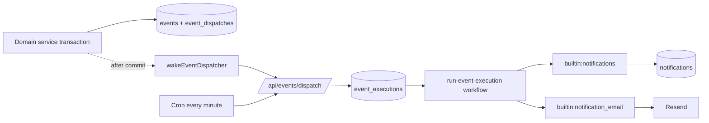

# Events and notifications

Starter ships the infrastructure for recording business facts as **events** and reacting to them with durable
**consumers**: an in-app notification inbox, per-member preferences, and email delivery. The event catalog and the
notification type registry are empty extension points; a product adds its own types.

| Term         | Meaning                                                                                      |
| ------------ | -------------------------------------------------------------------------------------------- |
| Event        | Immutable, organization-scoped fact committed in the same transaction as the change it names |
| Consumer     | A built-in reaction keyed `builtin:{name}` that runs once per matching event                 |
| Execution    | One consumer's work for one event: state, attempts, outcome code                             |
| Notification | One inbox row for one recipient, with seen, read, archived and resolved state                |
| Delivery     | One email send of a notification type to one recipient                                       |



## Guarantees

- **Atomic.** `appendEvents` runs inside the producer's transaction, so a rolled-back change records no event.
- **Trusted facts.** Only server-side domain services append events. Organization, actor and source come from the
  authenticated context, never from request bodies.
- **Idempotent producers.** Each event has a producer key `{type}:{subject.id}:{subject.revision ?? "-"}` that is
  unique per organization; replaying a producer inserts nothing.
- **At least once.** Every committed event is expanded and every execution reaches a terminal state. Side effects use
  stable keys (the email delivery ID is the Resend idempotency key); nothing promises exactly-once network effects.
- **Isolated.** Each consumer has its own execution and retries; one failing consumer never delays another.
- **Current authority.** Recipients are resolved from current memberships, roles and preferences when the consumer
  runs, and the acting user is never notified about their own action.
- **Minimal data.** Event `data` is a small flat record (`EventData`: strings, numbers, booleans, null and string
  arrays). Keep personal data and free text out of it; logs carry IDs and codes only.

## Code layout

| Location                                                           | Contents                                                                                             |
| ------------------------------------------------------------------ | ---------------------------------------------------------------------------------------------------- |
| `packages/db/src/schema/events/`                                   | `events`, `event_dispatches` (outbox), `event_executions`                                            |
| `packages/db/src/schema/notifications/`                            | `notifications`, `notification_inboxes`, `notification_preferences`, `notification_email_deliveries` |
| `packages/server/src/services/events/catalog.ts`                   | `eventCatalog`: event types, subject types and data schemas                                          |
| `packages/server/src/services/events/append.ts`                    | `appendEvents` and `wakeEventDispatcher`                                                             |
| `packages/server/src/services/events/dispatch.ts`                  | Expansion, run start, stranded-run recovery, and `runEventRetention`                                 |
| `packages/server/src/services/events/executions.ts`                | `builtinConsumers`, Redis pause switches, claiming, attempts, retries and settlement                 |
| `packages/server/src/services/notifications/registry.ts`           | `notificationTypes`: notification type definitions                                                   |
| `packages/server/src/services/notifications/projector.ts`          | `builtin:notifications`: inbox rows                                                                  |
| `packages/server/src/services/notifications/email.ts`              | `builtin:notification_email`: recipients, content builders, deliveries                               |
| `packages/server/src/services/notifications/inbox.ts`              | Inbox list, counts, seen, read and archive                                                           |
| `packages/server/src/services/notifications/preferences.ts`        | Per-member channel settings                                                                          |
| `packages/server/src/workflows/run-event-execution/`               | The Vercel Workflow that runs one execution                                                          |
| `packages/server/src/api/cron.ts`                                  | `handleEventDispatch` and `handleEventRetention`                                                     |
| `apps/webapp/src/app/[locale]/dashboard/components/notifications/` | Bell, inbox panel, rows and grouping                                                                 |
| `apps/webapp/src/app/[locale]/dashboard/components/settings/`      | Notifications settings tab                                                                           |

Surfaces:

- oRPC routers `notifications` (`list`, `counts`, `markSeen`, `markRead`, `archive`, `archiveAll`) and
  `notificationSettings` (`getAll`, `update`; also exposed on `/api/v1`).
- AI tools `getNotificationSettings` and `updateNotificationSetting` (approval-gated) with the `notifications` skill.
- MCP tools `list_notification_settings` and `update_notification_setting`.

## Lifecycle

1. **Append.** A domain service calls `appendEvents({ events, organizationId, source, transaction })` inside its
   transaction. Each event's `data` is parsed with its catalog schema; a parse or insert failure fails the transaction.
   The function inserts `events` and one `event_dispatches` row per new event and returns the inserted IDs.
2. **Wake.** After commit, call `wakeEventDispatcher({ eventIds })` (wrap it in `waitUntil` from a request handler;
   await it from a workflow step). It posts to `/api/events/dispatch` on `WEBAPP_URL` (falling back to `getBaseURL()`)
   with `Authorization: Bearer $CRON_SECRET`. Without `CRON_SECRET`, or when the request fails, it logs a warning and
   the cron picks the events up.
3. **Expand.** The dispatcher locks each pending dispatch row (`FOR UPDATE SKIP LOCKED`), inserts one
   `event_executions` row per built-in consumer whose `events` list includes the type, marks the dispatch expanded, and
   starts one `runEventExecutionWorkflow` run per new execution. An unknown type or failed expansion is retried with
   exponential backoff (30 seconds doubling, capped at one hour) for up to 24 attempts.
4. **Run.** The workflow claims the execution, sleeps until `available_at` if needed, and calls the consumer. A consumer
   returns `{ code, state: "succeeded" | "skipped" }`; a thrown error schedules a retry after 30 s, 2 min, 10 min,
   30 min and 2 h, then settles as `failed` (`retries_exhausted`). A paused consumer is rechecked every five minutes.
5. **Recover.** The minute cron (`GET /api/events/dispatch`) expands due dispatches, restarts queued executions whose
   start was not acknowledged within two minutes, and cancels and requeues `running` or `retry_wait` executions whose
   15-minute deadline (`expected_by`) has passed.

Execution states are `queued`, `running`, `retry_wait`, `succeeded`, `skipped`, `failed`, `cancelled` and `unknown`.

## Adding an event type

Add an entry to `eventCatalog` in `packages/server/src/services/events/catalog.ts`. Use `{subject}.{change}` names in
lower snake case and keep `data` small and flat:

```ts
import { z } from "zod";

export const eventCatalog: Record<string, { data: z.ZodType<EventData>; subjectType: string }> = {
	"file.ingestion_failed": {
		data: z.strictObject({ fileId: z.uuid(), fileName: z.string() }),
		subjectType: "file",
	},
};
```

Then append it from the owning service, in the same transaction as the change:

```ts
const eventIds = await db.transaction(async (transaction) => {
	// ...domain writes...
	return appendEvents({
		events: [
			{
				actor: { type: "system" },
				data: { fileId, fileName },
				subject: { id: fileId, revision: attemptId },
				type: "file.ingestion_failed",
			},
		],
		organizationId,
		source: "workflow",
		transaction,
	});
});

await wakeEventDispatcher({ eventIds });
```

- `actor` is `user`, `api_key`, `system`, `visitor` or `automation`; `source` is one of `eventSources` in
  `packages/db/src/schema/events/events.ts`.
- `subject.revision` is the discriminator for the producer key. Use the resulting revision, or a run or attempt ID, so
  a replay produces the same key and a genuinely new fact produces a new one.
- Emit only for committed, effective changes; skip no-op saves and rejected writes.
- Removing, renaming or retyping a `data` field is a breaking change for stored events and queued executions; prefer
  adding optional fields.

An event with no consumer is still recorded and is removed by retention.

## Adding a built-in consumer

Add an entry to `builtinConsumers` in `packages/server/src/services/events/executions.ts`. The key becomes the consumer
key `builtin:{name}`, and `events` lists the types it handles:

```ts
const builtinConsumers = {
	notification_email: { events: ["file.ingestion_failed"], run: sendNotificationEmails },
	notifications: { events: ["file.ingestion_failed"], run: projectNotificationEvent },
	file_cleanup: { events: ["file.ingestion_failed"], run: cleanUpFailedIngestion },
} satisfies Record<string, BuiltinConsumer>;
```

- `run({ event })` receives the stored `EventRecord` and returns `{ code, state }`. Return `skipped` with a short code
  when there is nothing to do; throw to retry.
- Make `run` idempotent: an attempt can repeat after a crash or deadline recovery. Changes go through the owning domain
  service, which may append further events.
- The two notification consumers derive their `events` from the notification registry, so a notification type's event
  is subscribed automatically (email only when the type defines `email`).

## Adding a notification type

Add an entry to `notificationTypes` in `packages/server/src/services/notifications/registry.ts`:

```ts
export const notificationCategories = ["library"] as const;

export const notificationTypes = {
	file_ingestion_failed: {
		category: "library",
		email: { audience: "writers", locked: false },
		event: "file.ingestion_failed",
		groupKey: "fileId",
		inApp: { audience: "members", locked: false },
		order: 10,
		showInSettings: true,
	},
} satisfies Record<string, NotificationDefinition>;
```

- `event` is the catalog type that creates it. The projector copies the event's `data` into `notifications.params`, so
  every value the UI shows must be in the event data.
- `groupKey` names a `data` field (the subject ID is used when it holds no string). The inbox collapses consecutive
  unread notifications of the same type and group into one row.
- `audience` is `members` (`read` permission) or `writers` (`write` permission). `email: null` disables email for the
  type. `locked: true` keeps a channel on and hides its toggle.
- `category` must be listed in `notificationCategories`; `category`, `order` and `showInSettings` control the Notifications
  settings tab.
- Add webapp messages in both `apps/webapp/src/i18n/messages/en.json` and `ar.json`: `notifications.types.{type}.title`
  (an ICU message that receives `count`, the size of the group) and `notifications.types.{type}.setting`, plus
  `notifications.categories.{category}` for a new category.

Recipients are the organization's members whose role satisfies the audience, excluding the acting user and anyone who
turned the channel off. Each recipient gets one `notifications` row per event and type (unique), and a per-recipient
sequence from `notification_inboxes` orders the inbox and drives the unseen count.

## Adding email content

Email is sent only for notification types that define `email` and have a content builder. Register one in
`emailContentBuilders` in `packages/server/src/services/notifications/email.ts`:

```ts
// Entry inside emailContentBuilders:
file_ingestion_failed: async ({ event, locale, settingsLink }) => ({
	html: await render(FileIngestionFailedEmail({ fileName: String(event.data.fileName), locale, settingsLink })),
	subject: getI18n({ locale }).t("fileIngestionFailed.subject"),
}),
```

- A builder returns `{ html, subject, replyTo? }`, or a `{ code, state: "skipped" }` outcome to skip the send (for
  example when the subject no longer exists).
- Put the React Email template in `packages/email/src/emails/`, export it from `packages/email/src/index.ts`, and add
  English and Arabic strings to `packages/email/src/locales/messages/`. Render with `render` from `react-email`, as
  `packages/server/src/services/auth-emails.ts` does. Include `settingsLink` so recipients can change their preferences.
- The sender currently uses the `en` locale for every recipient.
- Each recipient gets a `notification_email_deliveries` row; its ID is the Resend idempotency key and `accepted_at` is
  set when Resend accepts the message, so retries skip recipients already sent. Any failed send retries the execution.
- Email is sent only where `VERCEL_ENV` is `production` or `EVENTS_EXTERNAL_DELIVERY=1`; elsewhere the consumer skips
  with `delivery_disabled`. In-app notifications work in every environment.

## Retention

The hourly `/api/events/retention` cron deletes events recorded more than one day ago in batches of 1,000 within a
45-second budget. Notifications, executions, dispatches and email deliveries cascade with their event. Events with an
open execution (`queued`, `running`, `retry_wait`) or an unexpanded dispatch that can still be retried are kept until
that work finishes. Preferences are kept until the member or organization is deleted.

## Operations

- Crons in `apps/webapp/vercel.json`: `/api/events/dispatch` every minute and `/api/events/retention` hourly. Both
  require `Authorization: Bearer $CRON_SECRET`; `bun --cwd apps/webapp run dev:cron` calls the every-minute crons
  locally when `CRON_SECRET` is set.
- Pause a consumer by setting the Redis key `starter:events:paused:builtin` (every built-in consumer) or
  `starter:events:paused:builtin:{name}` to `1`. Paused executions wait in `retry_wait` and resume after the key is
  removed. Switches are read through the fail-fast `REDIS_URL` client; a Redis failure counts as not paused.
- Inspect work that has not finished:

```sql
select consumer_key, state, outcome_code, attempt_count, next_attempt_at, expected_by
from event_executions
where state in ('queued', 'running', 'retry_wait')
order by available_at;
```

- Failures log `Event execution attempt failed`, `Event expansion failed` and `Notification email failed` with event or
  execution IDs only.
